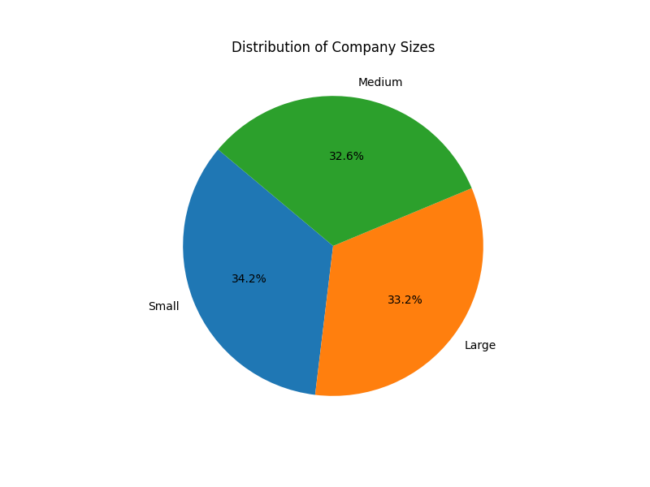
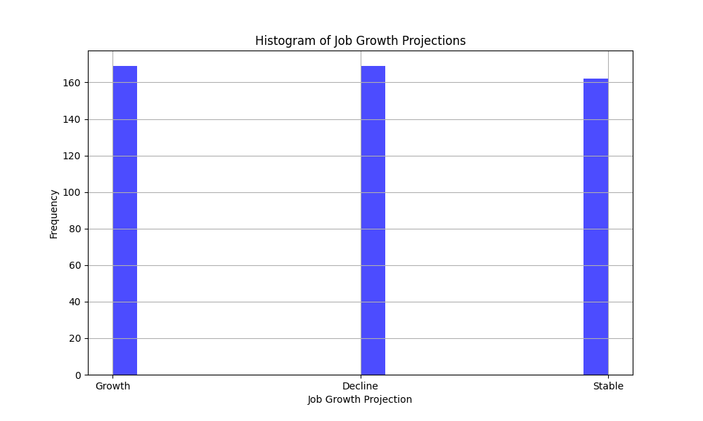
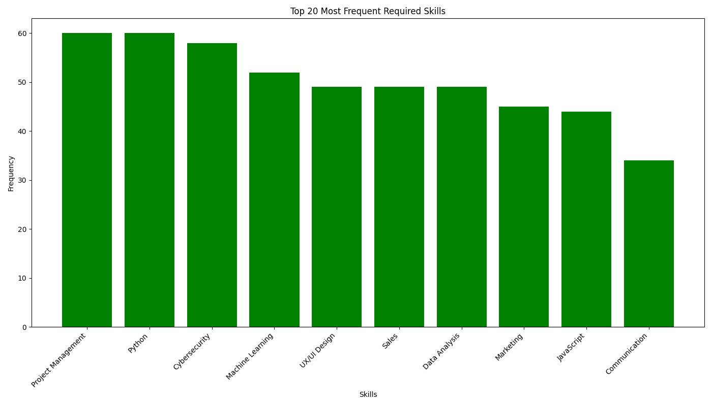

# Joey Yu(yy373)

## Google Colab
*https://colab.research.google.com/github/yuyue1999/JoeyYu_Assignment9/blob/main/main.ipynb#scrollTo=OcSSKglF8lOK

## Brief Introduction

### Dataset
https://www.kaggle.com/datasets/uom190346a/ai-powered-job-market-insights

#### [`ai_job_market_insights.csv`](ai_job_market_insights.csv)
The "AI-Powered Job Market Insights" dataset provides a synthetic but realistic snapshot of the modern job market, particularly focusing on the role of artificial intelligence (AI) and automation across various industries. This dataset includes 500 unique job listings, each characterized by different factors like industry, company size, AI adoption level, automation risk, required skills, and job growth projections. It is designed to be a valuable resource for researchers, data scientists, and policymakers exploring the impact of AI on employment, job market trends, and the future of work.

### Python Scripts

In [`src/main.py`](src/main.py), This code reads a dataset on the AI job market, generates descriptive statistics, and creates visualizations for company size distribution, job growth projections, and the most common required skills. It compiles these analyses into a PDF report with the corresponding charts. [here](AI-Powered_Job_Report.pdf).

#### Descriptive Statistics
          Salary_USD
count     500.000000
mean    91222.390974
std     20504.291453
min     31969.526346
25%     78511.514863
50%     91998.195286
75%    103971.282092
max    155209.821614

#### points histogram

#### assists histogram

#### blocks histogram

